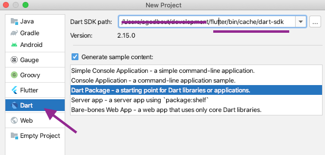
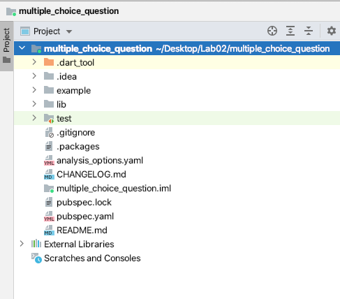
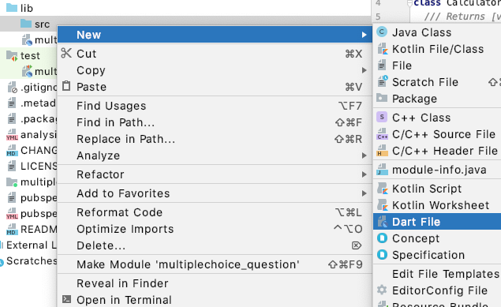

[](https://classroom.github.com/a/THaarjXi)
# cs3130-lab02

# Winning Streak

## The trivia game of champions

Over the course of the semester we will develop a trivia game app called **Winning Streak**. The game involves answering multiple choice questions while trying to build the longest streak of correctly answered questions in a row.

The app will be designed in Flutter with many of the skills we will learn over the course of the semester. You will practice much of the course theory as you develop the app.

We now know enough dart that we can start working on part of our app.

Today we will start a Dart package to create multiple choice questions. We will add the first classes to our package:
  - MCQuestion: a class to represent the multiple choice question, including the question text, and the possible choices
  - unittests: a few unittests to ensure our Question class is functioning properly

## Task 1: Open Android Studio and Create a Dart Package

  

  


  - Enter `multiple_choice_question` as the Project name

  - Store the project in a location you can find it. Note: Before you leave the lab you should save your work onto a USB drive or upload it such that you can retrieve it later (if using the lab computers).

  <details><summary>Trouble Shooting</summary>
  <p>

    - Make sure you have both the flutter plugin and dart plugin installed for android studio

    - The Dart SDK path is not always found in Android Studio. Flutter automatically installs it into: `<location of flutter sdk>/bin/cache/dart-sdk`

  </p>
  </details>
<br>

  After this completes you should see the Android Studio Project view in the top left and should be able to navigate through folders.

  Today we will (mostly) edit and create files in `lib/` where our source code for our package will reside.

  


## Task 2: Update the README.md

As a first go, replace the first TODO with a short description of the package:

`A package to create and represent multiple choice questions`

You can leave the other boiler plate code in place for now.

## Task 3: Create the MCQuestion class:



Back in the Project view (left pane with folders and file), expand the lib directory and then right click the `src` folder and select `New->Dart File`

Specify the name as mc_question.dart  

In our design we will have a `MCQuestion` class. A MCQuestion is made up of a category (String) in which the question falls, the question text (String) giving the question, some number of possible choices (Strings) and an index position of the correct choice (int).

Example Question:
```Courier
category: the serpent
question: Kaa the serpent had his mesmerizing eyes
set on Mowgli in this 1967 Disney favorite

choices: [ Raiders of the Lost Ark,
          The Jungle Book,
          Conan the Barbarian,
          Kill Bill ]

correct index: 1
```

Eventually we'll fetch questions from a Jeopardy Database (which is why these questions have categories, etc). For now we don't need to worry too much about that.

### Something to think about:

When we instantiate a MCQuestion object we will know all of the above fields, i.e., we will pass them all to the object when it is created. We will not require any *setters*.

Recall that Dart variables are non-nullable by default and so declaring class instance fields and class constructors might require a little practice. In class we discusses some topics that might help you design the MCQuestion class constructor:

- late
- nullable
- intializing formals
- initializer list
- final
- non-nullable by default
- assigned in the constructor
- assigned at declaration
- public by default, private with `_`

Create the MCQuestion class and define the instance fields and object construction. Make sure if someone tries to create a MCQuestion object with 4 choices but a correctIndex of -4 that an `RangeError.index` is thrown. This error / exception is perfect for instances when a programmer has not provided an appropriate index to a function - constructing a RangeError.index requires the erroneous index and the iterable that they were supposed to be accessing something in: `throw RangeError.index(badIndex, myList)`


```dart

///file: mc_question.dart
class MCQuestion {

  //instance fields

  //constructor

}
```

<details><summary>Hint</summary>
<p>

- If you make an instance field `final` then it cannot be modified
  - you can leave it public and avoid having to declare a `getter`
  - for OOP design reasons we don't want a `getter` for our choices, because we don't want people knowing/depending on how we've stored them (List, Set, Map, etc).
    - thus choices should be declared as a private variable using `_`, e.g. `_choices`

```dart
class MCQuestion {

  //just some of the instance fields
  final String category;
  final String questionText;

  //...

}
```  
</p>
</details>
<br>

Did you make sure in the constructor to throw an error if another programmer has supplied an incorrect `correctIndex`?


<details><summary>Solution so far</summary>
<p>
I chose a formal initializer for my constructor and use a List<String> for my choices. That means anyone constructing a MCQuestion object is required to pass in a List of choices.

```dart

///represent a multiple-choice question
class MCQuestion {

  //instance fields
  final String category;
  final String questionText;
  final int correctIndex;

  final List<String> _choices;

  //using initializing formals
  MCQuestion(this.category, this.questionText, this._choices, this.correctIndex) {
    if (correctIndex < 0 || correctIndex >= _choices.length) {
      throw RangeError.index(correctIndex, _choices);
    }
  }
}

```
</p>
</details>
<br>

## Task 4: Complete MCQuestion
We need to complete a few methods to help make MCQuestion more useful:

- a getter for the choiceCount
  - _choices is private and so users of our class shouldn't be gaining access to it to see how many choices their are - we need to give them a public getter `choiceCount` to return the number of choices.

- a method to access a given choice: `String getChoice(int index)` : returns the choice at a given index. Throws `RangeError.index` if the provided index is not in the range:  [0:choiceCount).  

- `@override` `toString()`
  - helpful for debugging


<details><summary>Hints</summary>
<p>

- use a `StringBuffer` for building the String in `toString`
  - we assume to have a small number of choices but if there were ever many then StringBuffer could improve performance
- use the arrow syntax for a one-line getter for `choiceCount`
- update all your calls to `_choices.length` to use the `choiceCount` getter as opposed to the poorer programming practice of having all these calls to `_choices.length` everywhere. If we ever changed `_choices` in some way this kind of vigilance will help.
</p>
</details>
<br>


## Task 5: Testing

So far we are coding without knowing if our code works. We should add unit-tests for all of our classes. Let's add some unit-tests and see how our code performs.

**First** a note on imports.

  - Within our package (i.e., inside the `lib` directory) we can use relative paths. i.e. `import 'src/mc_question.dart';`
  - Outside our package (i.e., all other directories) we should use the package name i.e., 'import package:multiple_choice_question'

To help set-up our package navigate to `lib/multiple_choice_question.dart` and add an export statement:

```dart
export 'src/mc_question.dart';
```
***unit-tests***

- Open the file: `test/multiple_choice_question_test.dart`

crate a new group (these are tests that are run together and have results presented together). Add some set-up. You'll want to note the below `late` modifier added to the MCQuestion declaration.

```dart
group("MCQuestion", () {
  //perform some common set-up
  List<String> choices = ["A", "B", "C"];

  String category = "A,B or C";
  String text = "Is is A,B or C?";

  int c = 2;

  late MCQuestion question;

  //the setUp method gets called before every test in this group
  setUp(() {
    question = MCQuestion(category, text, choices, c);
  });

}//end of group MCQuestion

```

- Add your first unit-test:

The follow will test whether the MCQuestion object returns the correct index. Add it to the group("MCQuestion") () { ...}.

```dart
test('test correct index on declaration', () {
      expect(question.correctIndex, 2);
});
```

Run all the unit-tests in this group by right-clicking on the group and selecting `Run MCQuestion` or clicking the green arrows in the margin of the source code.

If your test passes you'll see Tests passed 1 of 1. Because our test has no output we don't see anything else.

Modify the above test so it prints the question object and rerun the tests to see the results - you should see some output even if the tests pass now.

Ensure the tests pass before moving on.

## Task 6 Add More Unit-tests

Add unit-tests to ensure the MCQuestion class works correctly.

Here is a test to get you started. It ensures that an out of bounds index (too low) throws a RangeError exception on creation:

```dart
test('correct index too low on creation throws RangeError', () {
      expect( () => MCQuestion(category, text, choices, -1), throwsA(isRangeError));
    });
```
- Add a similar test that ensures if you create a `MCQuestion` with exactly 3 choices (indices: 0,1,2) and a correctIndex of 3 that a `RangeError` is also thrown

- Inspect the MCQuestion class and come up with at least 3 other unit-tests to add to the class.

- **Ask a peer** what unit-tests they have added in this step.


*The remaining steps are time pending*

## Task 7 Add a Shuffle Method

Add a shuffle method to the MCQuestion class that will shuffle the order of the choices.

```dart

//mc_question.dart

///shuffle the choices
void shuffle() {
    //fn body here

}
```

## Task 8 Test the Shuffle method

The following can be a first unit-test for testing your shuffle method. Add this unit-test to the MCQuestion group and ensure it passes then add other unit-tests as you require.

```dart
test('test correct index works after random shuffle', () {
  String correctText = question.getChoice(correctIdx);

  //Everyday I'm shuffling (until the choice at idx 2 moves)
  while (question.getChoice(correctIdx) == correctText) {
    question.shuffle();
  }
  expect(question.correctIndex, isNot(2));
});
```

Run the test and ensure it passes.

**correctIndex**

if you didn't catch this above, perhaps the unit-testing will have brought it to your attention. If we allow a `MCQuestion` to shuffle its choices then we cannot allow `correctIndex` to be declared final (because it has to change to match the index of the correct choice).

You'll have to refactor the code to fix this, which might mean changing `correctIndex` to not be `final`, but then we don't want anyone outside the class altering it, so make it private (`_correctIndex`) and add a getter: `int get correctIndex ...`

*Lab completed!*

<details><summary>Possible MCQuestion class solution</summary>
<p>

```dart
///represent a multiple-choice question
class MCQuestion {

  //instance fields
  final String category;
  final String questionText;

  int _correctIndex;
  final List<String> _choices;

  //initializing formals
  MCQuestion(this.category, this.questionText, this._choices, this._correctIndex) {
    if (correctIndex < 0 || correctIndex >= choiceCount) {
      throw RangeError.index(correctIndex, _choices);
    }
  }

  int get correctIndex => _correctIndex;

  int get choiceCount => _choices.length;

  //only comment methods when it isn't readily apparent from the method
  //name and parameter list / return type what the method does.
  //this method does not require comments. (delete this once you read it)
  String getChoice(int index) {
    if (index < 0 || index >= choiceCount) {
      throw RangeError.index(index, _choices);
    }
    return _choices[index];
  }


  ///shuffle the choices and ensure the correct index moves as well
  void shuffle() {
    String correctText = _choices[correctIndex];

    _choices.shuffle();
    _correctIndex = _choices.indexOf(correctText);
  }

  @override
  String toString() {
    var buffer = StringBuffer("category: $category\nquestion: $questionText\n");
    buffer.write("choices:\n");
    for (var i = 0; i < choiceCount; i++) {
      buffer.write("${_choices[i]}\n");
    }
    buffer.write("correct index: $_correctIndex");
    return buffer.toString();
  }
}

```
</p>
</details>
<br>
